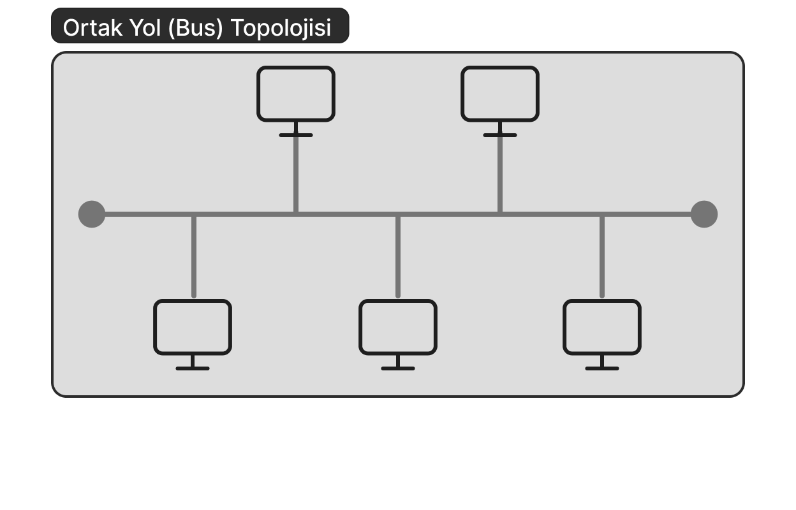
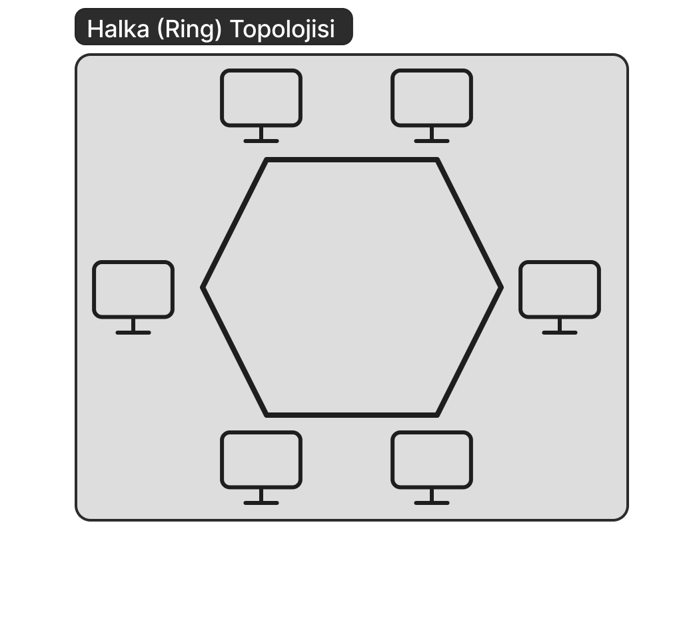
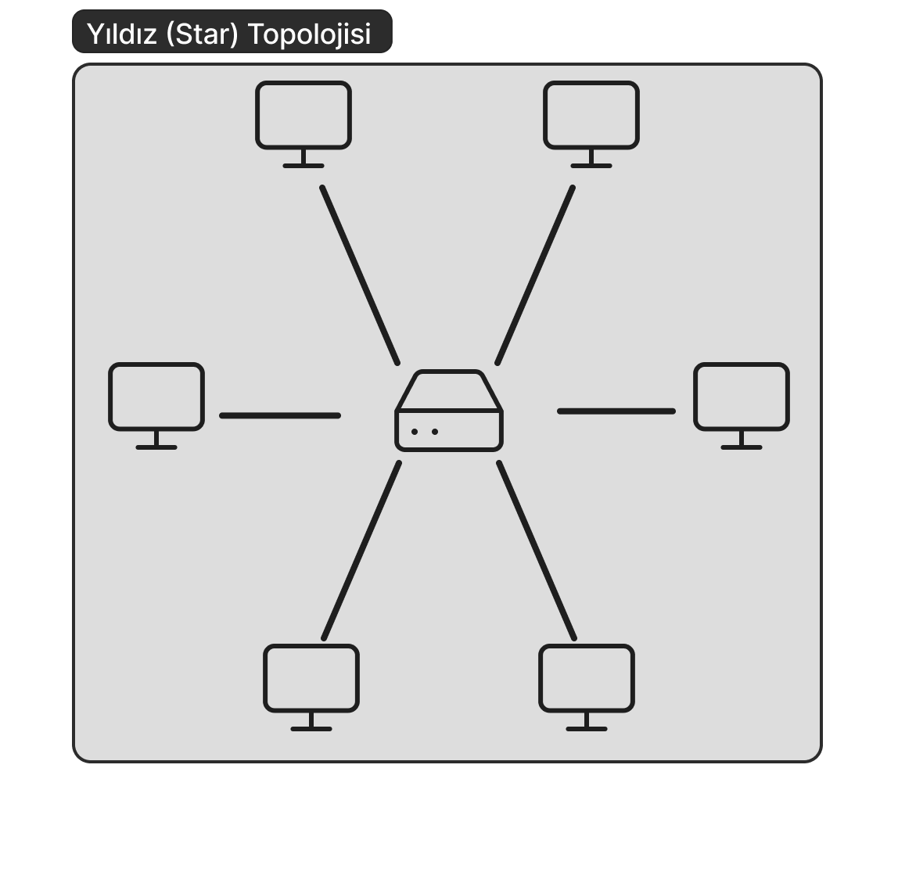
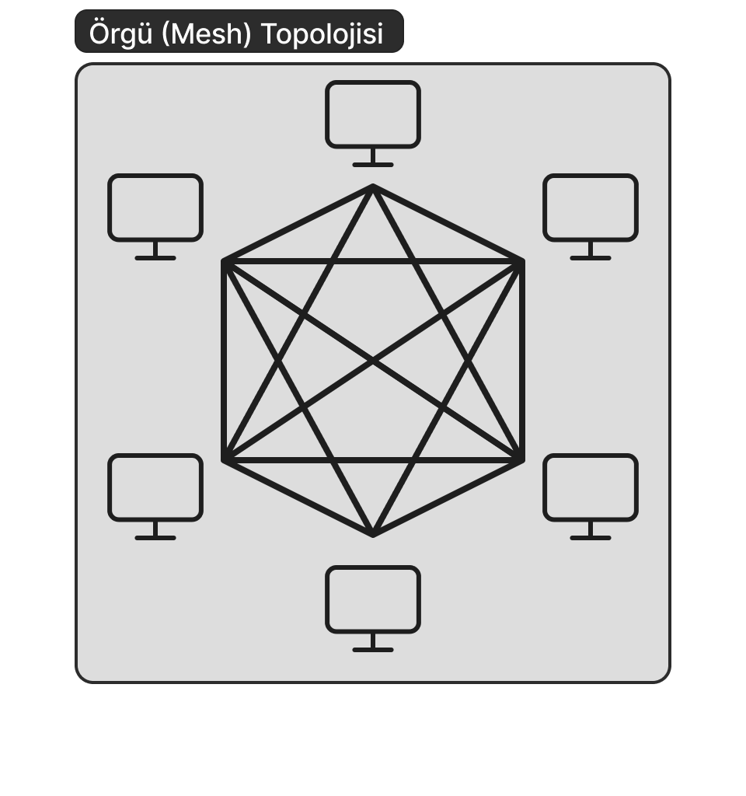
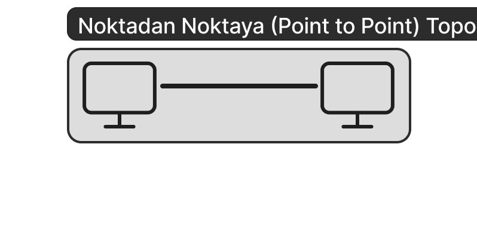
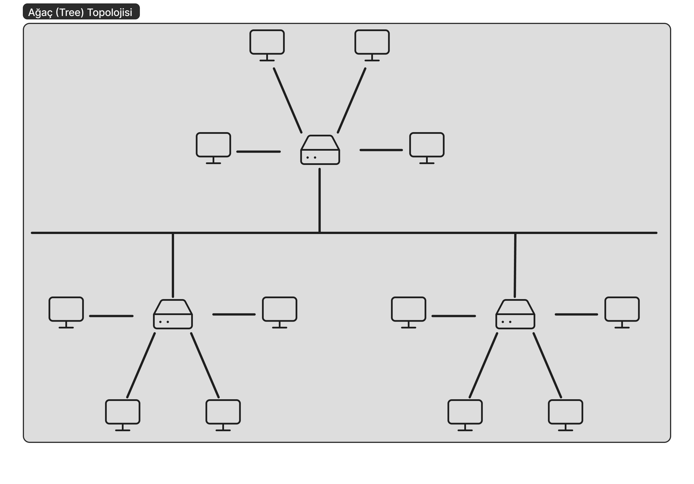

   
## Ağ Topolojisi Nedir?   
Ağ topolojisini basitçe tanımlayacak olursak *bir bilgisayar ağının çeşitli bileşenlerinin düzenlenmesi* olarak tanımlayabiliriz. Ağ topolojilerini **fiziksel topoloji** ve **mantıksal topoloji** olarak iki başlık altında sınıflandırmamız mümkündür. Bu yazıda genel olarak fiziksel topoloji türlerinden bahsedeceğim ancak öncesinde kısaca mantıksal topolojiye değinelim.   
## Mantıksal Topoloji Nedir?   
Ağ cihazlarının birbirleriyle olan iletişimlerinde bu iletişimi nasıl kuracaklarını, verilerin ağ içinde nasıl aktarıldığını gösteren topoloji türüne mantıksal topoloji denir.   
Mantıksal topolojiyi aradan çıkardığımıza göre şimdi asıl konumuz olan fiziksel topolojiye dönebiliriz.   
## Fiziksel Topoloji Nedir?   
Fiziksel topoloji, ağı oluştururken kullanılan çevre birimlerini ve fiziksel bağlantı metodlarından bahsederken kullanılan kavramdır. Ağın yapısında kullanılan kablo türü ve ağda kullanılan cihazlar bu topolojide belirtilir. Fiziksel topoloji türlerini **ortak yol (bus)**, **halka (ring)**, **yıldız (star)**, **gelişmiş yıldız (ext star)**, **örgü (mesh)**, **noktadan noktaya (point-to-point)** ve **ağaç (tree)** topolojileri olarak belirtebiliriz.   
Gelin şimdi bu topoloji türlerini teker teker inceleyelim.   
### Ortak Yol Topolojisi (Bus Topology)   
Ortak yol topolojisinde tüm cihazlar tek bir omurgaya bağlıdır. Bu omurgada tipik olarak koaksiyel kablo kullanılır.
Ortak yol topolojisinde sinyal tüm cihazları dolaşır. Cihazlar gelen sinyali kontrol eder ve şayet sinyal adresi kendileriyle alakalıysa sinyali işler, değilse pasif davranır ve sinyali bırakır.   
Kullanılan koaksiyel kablonun ince olduğu durumlarda hat uzunluğu maksimum 185 metre, kalın olduğu durumlarda 500 metredir.   
Ağa maksimum 30 cihaz bağlanabilir ve omurganın her iki ucunda sonlandırıcı bulunur. Sinyal hedef cihaza ulaşana kadar hattaki tüm cihazları dolaştığı için ağ performansı düşüktür.   
    
Özetleyecek olursak ortak yol topolojisinin;   
### Avantajları:   
- Ağın kurulumu kolaydır.   
- Ağa yeni cihaz eklemek kolaydır.   
- Ekonomiktir.   
- Tüm cihazlar tek bir omurga üzerinde dizili olduğu için kablo kullanımı azdır.   
- Switch/Hub gerekmez.   
   
### Dezavantajları:   
- Ağa bağlanabilecek cihaz sayısı sınırlıdır.   
- Hat uzunluğu sınırlıdır. (İnce kabloda 185 metre, kalın kabloda 500 metre.)   
- Omurgada yaşanan herhangi bir sıkıntı tüm ağı etkiler.   
- Yaşanan sorunların tespit edilmesi ve giderilmesi zordur.   
- Bant genişliği düşüktür.   
- Eklenen her yeni cihaz ağ performansını düşürür.   
   
### Halkta Topolojisi (Ring Topology)   
Halka topolojisinde adından da anlaşılacağı üzere tüm cihazlar bir halka şeklinde birbirine bağlanmıştır. Gönderilen veri alıcıya ulaşana kadar tüm cihazlara teker teker uğrar. Sinyaller bir cihazdan diğerine tek yönlü olarak iletilir. Yani her cihaz kendinden önceki cihaz için bir alıcı, kendinden sonraki cihaz için bir gönderici konumundadır. Gelen sinyal her birimde yeniden oluşturulduğu için sinyal zayıflaması en düşük düzeydedir.   
Ağ üzerindeki veri 3 byte'lık jeton (token) adı verilen bir paket ile gönderilir. Bu paket alıcıya ulaşana kadar tüm cihazları dolaşır. Halka topolojisinde merkezde bir [MAU (Multistation Access Unit)](https://networkencyclopedia.com/multistation-access-unit-mau/) bulunur.   
50 cihazdan oluşan bir ağ olduğunu düşünürsek ilk cihazdan son cihaza gönderilecek bir veri 49 cihazı teker teker dolaştıktan sonra alıcıya ulaşacaktır.   
    
Özetleyecek olursak halka topolojisinin;   
### Avantajları:   
- Herhangi bir sunucuya ihtiyaç yoktur.   
- Ağda bulunan tüm cihazlar aynı yetkiye sahiptir.   
- Ağın büyütülmesinin performansa etkisi düşüktür.   
- Kurulumu kolaydır.   
- Bu tür topolojilerde çarpışma olasılığı minimumdur.   
   
### Dezavantajları:   
- Kullanılan kablo miktarı fazla olduğu için ve MAU pahalı olduğu için maliyeti yüksektir.   
- Cihazların herhangi birinde yaşanan bir arıza tüm ağı etkiler.   
   
### Yıldız Topolojisi (Star Topology)   
Her bir cihazın merkezde yer alan bir switch ya da hub'a bağlanmasıyla oluşturulan topoloji türüdür. Göndericiden çıkan bir veri önce merkezdeki bu switch veya hub'a gider, oradan da alıcı cihaza iletilir.   
Günümüzde en yaygın kullanıma sahip topoloji türüdür. Cihazlar arasındaki bağlantı çift burgulu kablolar ile sağlanır. Ağa bağlı cihazların hub veya switch'e olan uzaklıkları maksimum 100 metre olabilir. Bu uzunluğun üstüne çıkıldığı durumlarda performansta büyük düşüşler yaşanır.   
    
Özetleyecek olursak yıldız topolojisinin;   
### Avantajları:   
- Ağa yeni cihaz eklemek kolaydır.   
- Ağda yaşanan bir sorunun tespiti kolaydır.   
- Bağlı cihazlardan herhangi birinde yaşanan bir arıza ağın geri kalanını etkilemez.   
- Yapısı ve anlaşılması oldukça basittir.   
   
### Dezavantajları:   
- Merkezdeki hub veya switch'te yaşanan herhangi bir arıza tüm ağı etkiler.   
- Diğer topolojilere kıyasla kablo kullanımı fazladır.   
   
## Örgü Topolojisi (Mesh Topology)   
Örgü topolojisinde ağdaki her cihaz diğer tüm cihazlarla doğrudan bağlantılıdır. Çoğunlukla geniş alan ağları (WAN) arasında kullanılır. Ağa bağlı cihaz sayısının "N" olduğu bir senaryoda ağ üzerindeki bağlantı sayısı "N\*(N-1)/2" adettir.   
Her cihaz bir dier cihazla bağlantı kurduğu için ağdaki herhangi bir bağlantının kopması durumunda, veri diğer bağlantıları kullanarak alıcıya ulaşabilmektedir.   
Tüm örgü ve kısmi örgü olmak üzere iki çeşidi vardır. Tüm örgüde bütün cihazlar birbiriyle doğrudan bağlantı kurarken kısmi örgüde bir cihazın diğer tüm cihazlarla bağlantı kurmadığı durumlar vardır.   
Bu topolojinin başlıca öne çıkan özellikleri ölçeklenebilirlik, esneklik, sağlamlık ve tutarlı veri aktarımı olarak sıralanabilir. Ayrıca bu topolojide herhangi bir merkeze ihtiyaç olmaması da öne çıkan özelliklerinden bir diğeridir.   
    
Özetleyecek olursak örgü topolojisinin;   
### Avantajları:   
- Cihazlardan birinde yaşanan herhangi bir arıza ağın genelini etkilemez.   
- Veri iletim hızı oldukça yüksektir.   
- Ağın genişletilmek istendiği durumlarda diğer bağlantılar etkilenmediği için ağa yeni cihaz eklemek kolaydır.   
   
### Dezavantajları:   
- Bağlantı sayısının çok fazla olmasından dolayı karmaşık bir yapıya sahiptir.   
- Her cihaz birbiriyle bağlandığı için çok fazla kablo gerekir, haliyle maliyet yüksektir.   
   
## Noktadan Noktaya Topoloji (Point-to-Point Topology)   
Bir alıcı ve bir göndericiden oluşan en temel topolojidir. Bu topolojide veri aktarımı tek yönlü olabileceği gibi çift yönlü de olabilir. Bağlantı bir kablo aracılığıyla olabileceği gibi kablosuz olarak da kurulabilir.   
Yalnızca alıcı ve göndericiden oluştuğu için veri güvenliği bakımından avantajlı bir konumdadır.   
    
Özetleyecek olursak noktadan noktaya topolojinin;   
### Avantajları:   
- Yüksek bant genişliğine sahiptir.   
- Yalnızca iki cihaz arasında bağlantı kurulduğu için oldukça hızlı ve güvenlidir.   
- Kurulumu ve bakımı kolaydır.   
   
### Dezavantajları:   
- Cihazlar arasında tek bir bağlantı olduğu için bu bağlantının zarar görmesi durumunda ağ çöker.   
- Yine sadece iki cihazdan oluşan bir bağlantı olduğu için iki cihazdan herhangi birinin bozulması durumunda ağ kullanılamaz hale gelir.   
   
## Ağaç Topolojisi (Tree Topology)   
Temel olarak yıldız topolojisi ve ortak yol topolojilerinin birleşimi şeklinde oluşmuş bir topolojidir. Yıldız şeklinde oluşturulmuş dalların bir omurga üzerinde toplanmasıyla oluşturulur.   
Ayrıca bir başka yönden de ağaç topolojisi gelişmiş yıldız topolojisine benzerlik göstermektedir. Aralarındaki fark ise ağaç topolojisinde herhangi bir merkezi düğüme ihtiyaç duyulmamasıdır.   
Ağaç topolojisi büyük ağların omurgasını oluşturmak için kullanılır.   
**Omurga ağacı (backbone tree)** ve **ikili ağaç (binary tree)** olarak iki farklı yapıda oluşturulabilir. Omurga ağaç düzeninde bütün düğümler hiyerarşik bir düzen içinde alt dallara ayrılır. İkili ağaç düzeninde ise her düğüm sadece iki dala bölünerek yapıyı oluşturur. Ağaç topolojisinde verinin akışı hiyerarşik bir düzen içindedir. Bu yüzden bu topoloji **Hiyerarşik Ağaç Topolojisi (hierarchical tree topology)** olarak da adlandırılmaktadır.   
    
Özetleyecek olursak ağaç topolojisinin;   
### Avantajları:   
- Alt cihazlar arasındaki bağlantıda yaşanan bir arıza ağın genelini etkilemez.   
- Hata tespiti kolaydır.   
- Farklı donanım üreticilerinin ürünleri uyum içinde çalışabilir.   
   
### Dezavantajları:   
- Kullanılan kablo türüne göre alt cihazlar arasındaki mesafe limitli olabilir.   
- Ana omurgada yaşanan bir arıza tüm ağın çökmesine neden olur.   
- Ana omurgada aşırı trafik olması durumunda çarpışmalar ve gecikmeler yaşanabilir.   
   
## Özet   
Ağ topolojisi, bir bilgisayar ağındaki cihazların nasıl bağlandığını ve veri iletim sürecinin nasıl işlediğini belirleyen yapıdır. Mantıksal topoloji, verinin ağ içinde nasıl aktığını gösterirken, fiziksel topoloji ise cihazların fiziksel olarak nasıl bağlandığını tanımlar.   
Fiziksel topolojiler arasında en yaygın olanlardan biri yıldız topolojisidir; burada tüm cihazlar merkezi bir noktaya bağlanır, böylece yönetimi kolaydır ancak merkezde bir sorun olursa tüm ağ etkilenir. Ortak yol (bus) topolojisi, tek bir hat üzerinden iletişimi sağlar ama cihaz sayısı arttıkça performans düşer. Halka topolojisinde veri, cihazlar arasında sırayla dolaşır; bu yapı çarpışmaları önler ama bir cihaz bozulursa tüm ağ aksayabilir. Örgü topolojisi, her cihazın diğerleriyle bağlantılı olduğu güvenli ancak maliyetli bir yapıdır. Noktadan noktaya topoloji, en basit bağlantıyı sağlar ama sadece iki cihaz arasında çalışır. Ağaç topolojisi ise büyük ağlar için kullanılır ve verinin hiyerarşik bir düzende iletilmesini sağlar.   
Sonuç olarak, her topolojinin kendine özgü avantajları ve dezavantajları vardır. Kullanım alanına göre en uygun yapı seçilerek ağın performansı ve güvenilirliği sağlanabilir.   
   
