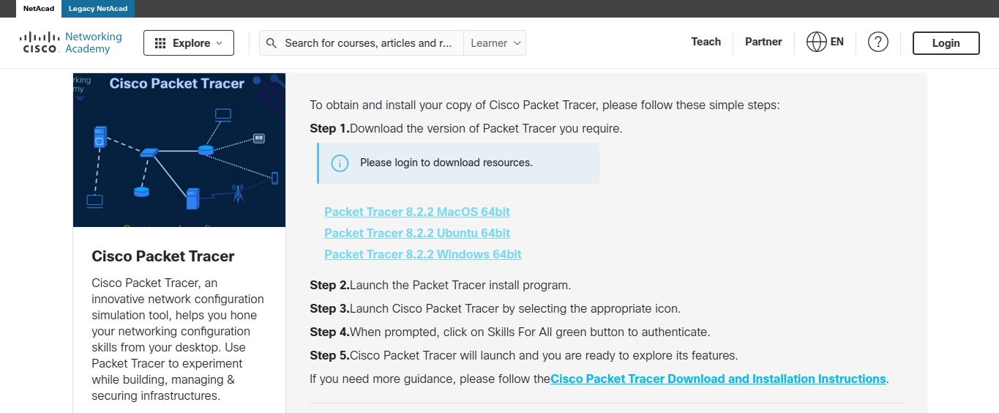

   
## Distrobox ile Cisco Packet Tracer Kurulumu   
    
Selamlar. Şayet siz de benim gibi Cisco Packet Tracer'ı kullanmak istiyor ancak Debian tabanlı dağıtımlar dışında kalan Linux dağıtımlarından birini kullanıyorsanız karşılaşacağınız ilk engel Cisco Packet Tracer'ın (yazının devamında sadece Packet Tracer olarak bahsedeceğim) Linux için sadece .deb dosyasının bulunması ve Flathub ya da Snap gibi sistemlerde de resmi bulunmaması olacaktır.   
Arch için AUR ile kurulum yapabilirsiniz ancak Fedora, Opensuse, Solus (kullanıcı sayısı nispeten az olmasına rağmen ben kullandığım için Solus'a pozitif ayrımcılık yapabilriim sanırım.) gibi dağıtımları kullanıyorsanız elinizin altında AUR olmadığı için çıkar yollardan biri daha kapanacaktır. Bu noktada yapabileceğiniz iki şey var.   
1. Kullanıdığınız dağıtımı değiştirmek.   
2. Distrobox kullanmak.   
   
Ben bu yazıda sizi dağıtım değiştirme zahmetinden kurtaracak olan ikinci seçeneği yani Distrobox kullanmayı anlatacağım.   
### Distrobox nedir?   

Burada uzun uzun distrobox yazılımının ne olduğunu ve nasıl çalıştığını anlatmayacağım ama kısaca bahsetmemiz gerekirse distrobox bir linux dağıtımı içinde dilediğiniz başka bir linux dağıtımını docker, podman gibi araçlar yardımıyla kullanmanıza olanak sağlayan bir yazılım diyebiliriz. Daha detaylı bilgi için [distrobox](https://distrobox.it/) resmi sitesini ziyaret edebilirsiniz.   
### Distrobox Kurulumu

Distrobox'u diğer tüm yazılımları kurduğunuz gibi kullandığınız dağıtımın yazılım deposunu kullanarak kurabilirsiniz.   
**Opensuse:**  
```
sudo zypper install distrobox
```
**Solus:**   
```
sudo eopkg install distrobox
```
**Fedora:**   
```
sudo dnf install distrobox
```

Diğer dağıtımlar için de benzer şekilde paket yöneticinizi kullanarak distrobox kurulumunu gerçekleştirebilirsiniz.   
Eğer distrobox kurulumunda podman ya da docker otomatik olarak indirilip kurulmadıysa yine aynı şekilde paket yöneticinizi kullanarak bu uygulamalardan birini kurmanız lazım. Ben bu yazıda podman üzerinden devam edeceğim.   

Distrobox ve Podman kurulumlarını tamamladık. Şimdi sıra geldi distrobox ile .deb paketlerini kurabileceğimiz ortamı oluşturmaya.   
Terminal ekranını açıyoruz ve sırasıyla şunları yazıyoruz:   
```
# Distrobox ile Debian ortamı kuruyoruz.
distrobox-create --name Debian --image debian:12 --home /home/kullanıcıadınız/distrobox/debian12

# Kurduğumuz Debian ortamına giriyoruz.
distrobox-enter Debian

# Ortamı güncelliyoruz.
sudo apt update

# Gerekli paketleri kuruyoruz.
sudo apt install libqt5multimedia5 libqt5xml5 libqt5script5 libqt5scripttools5 libqt5sql5

```
   
Şimdi sıra geldi işin en kolay kısmına. [Cisco'nun website](https://www.netacad.com/resources/lab-downloads?courseLang=en-US)sine gidip Packet Tracer'ı indimemiz gerekiyor. Burada seçim yaparken **Ubuntu** yazanı indirmeniz lazım.   
   
    
   
İndirme işlemini tamamladıysak kaldığımız yerden devam edebiliriz. Terminale dönüyoruz. (Distrobox açık olmalı.)   
```
cd Download # Eğer indirme klasörünüz farklıysa buraya indirme klasörünüzü yazmanız lazım.
sudo apt install ./Cisco... # İndirdiğiniz dosyayı seçeceksiniz. Yazıyı okuduğunuz tarihte sürüm ve isim değişmiş olabilir.

```
Tebrikler! Teknik olarak kurulumu tamamladık. Ama şu anda Packet Tracer'ı kullanabilmek için distrobox ile oluşturduğumuz Debian ortamına girip terminal üzerinden uygulamayı başlatmanız gerekiyor. Bununla uğraşmamak için son bir adım kaldı.   
Yine terminale dönüyoruz.   
```
distrobox-export --app packettracer
```
Artık Packet Tracer'a uygulama menünüz üzerinden erişebilir ve kullanabilirsiniz. Artık terminalle de bir işimiz kalmadığı için terminali de kapatabilirsiniz.   
Eğer bu içerik hoşuna gittiyse [Ağ Topolojilerinden bahsettiğim yazıma](https://kusca.dev/blog/01-ag-topolojisi/ag-topolojisi-nedir) da göz atmak isteyebilirsin…   
   
