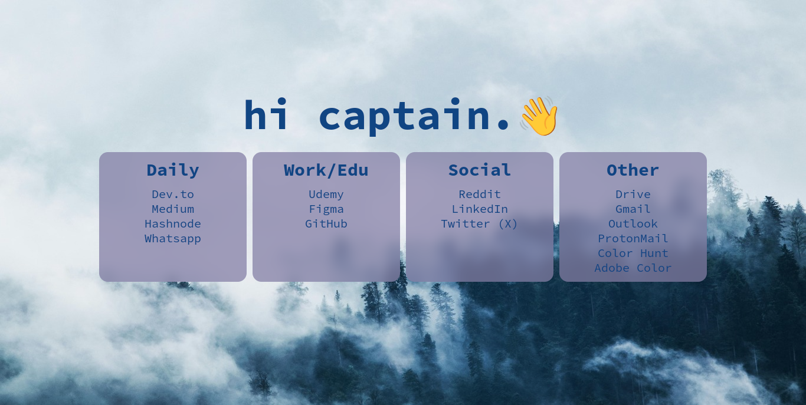

## Quicklinks

Quicklinks, sık kullandığınız web sitelerine tek bir noktadan erişebilmenize olanak sağlayan statik bir startpage projesidir.

## Özellikler

✅ Hızlı Erişim: Sık kullandığınız web sitelerine tek tıklama ile erişim sağlayın.

✅ Kullanıcı Dostu Arayüz: Temiz ve sezgisel bir tasarım.

✅ Özelleştirilebilir: Kendi bağlantılarınızı ekleyebilir ve düzenleyebilirsiniz.


## Kurulum

Bu depo'yu klonlayın:

```
git clone https://github.com/kuscadev/QuickLinks.git
```

Tarayıcı ayarlarınızda başlangıç sayfasını özelleştirin ve `index.html` dosyasının konumunu bağlantı olarak ayarlayın.

## Yapılandırma

Özelleştirebileceğiniz iki ana bölüm vardır:

1. **Renkler, Yazı Tipleri, vb.**: `grid.css` dosyasını açın ve istediğiniz öğelerin renklerini veya yazı tiplerini değiştirin.
2. **Bağlantılar**: Varsayılan bağlantılar günlük kullanım için faydalıdır, ancak kendi bağlantılarınızı ekleyebilir ve gereksiz olanları `index.html` dosyasını düzenleyerek kaldırabilirsiniz.

## Gelecek Güncellemeler

- [ ] **Koyu/Aydınlık Tema Desteği**: Kişiselleştirilmiş görsel bir deneyim için koyu ve aydınlık tema arasında geçiş yapabileceğiniz bir özellik.
- [ ] **Bağlantı Yönetimi**: Kullanıcıların dinamik olarak bağlantı ekleyip, düzenleyip, organize edebileceği bir arayüz.
- [ ] **Tarih ve Saat Gösterimi**: Sayfanın üst kısmında geçerli tarih ve saati gösteren bir bölüm.
- [ ] **Arama Çubuğu**: Kullanıcıların sayfa içinde belirli bağlantıları hızla aramalarını sağlayacak bir özellik.

## Lisans

Bu proje [MIT](https://opensource.org/license/mit) Lisansı ile lisanslanmıştır.
