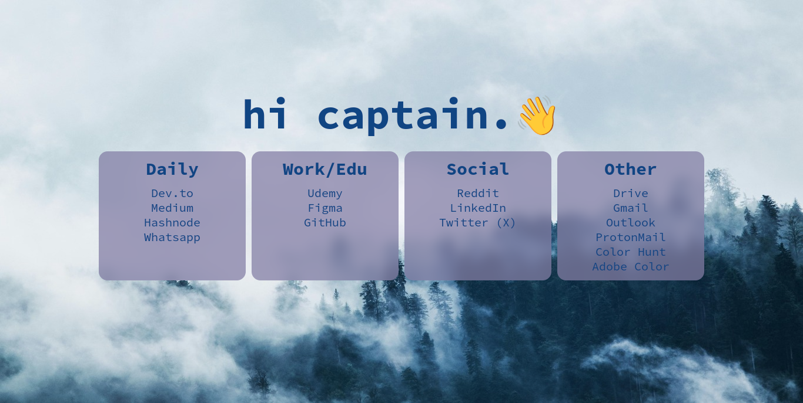

## Quicklinks

Quicklinks, sık kullandığınız web sitelerine tek bir noktadan erişebilmenize olanak sağlayan statik bir startpage projesidir.

## Özellikler

✅ Hızlı Erişim: Sık kullandığınız web sitelerine tek tıklama ile erişim sağlayın.

✅ Kullanıcı Dostu Arayüz: Temiz ve sezgisel bir tasarım.

✅ Özelleştirilebilir: Kendi bağlantılarınızı ekleyebilir ve düzenleyebilirsiniz.

## Kurulum

Github deposunu klonlayın:

```
git clone https://github.com/kuscadev/QuickLinks.git
```

Tarayıcı ayarlarınızda başlangıç sayfasını özelleştirin ve `index.html` dosyasının konumunu bağlantı olarak ayarlayın.

## Yapılandırma

QuickLinks projesinde iki ana özelleştirme bölümü bulunmaktadır:

1. **🎨 Tema Özelleştirme**:

   QuickLinks, CSS değişkenleri ve data-theme özelliği ile tema değiştirme ve görsel özelleştirmeyi destekler.

   **🔄 Tema Değiştirme**
   Temayı değiştirmek için `<html>` etiketi içinde `data-theme` özelliğini kullanabilirsiniz.

   Örnek:

   ```html
   <html data-theme="dracula"></html>
   ```

   Mevcut temalar:

   ✅ default
   
   ✅ dracula

   ✅ rose-pine-moon

   ✅ catppuccin

   **🎯 Renkleri ve Yazı Tiplerini Özelleştirme**

   Her tema, ilgili CSS değişkenlerini kullanır. Bu değişkenleri değiştirerek renkleri, yazı tiplerini veya boşlukları özelleştirebilirsiniz.

   Örnek:

   ```css
   [data-theme="dracula"] {
     --bg-color: #282a36;
     --text-color: #f8f8f2;
     --primary-color: #bd93f9;
   }

   [data-theme="catppuccin"] {
     --bg-color: #1e1e2e;
     --text-color: #cdd6f4;
     --primary-color: #f5e0dc;
   }
   ```

   **🛠 Varsayılan Temayı Değiştirme**

   Varsayılan temayı özelleştirmek isterseniz, aşağıdaki değişkenleri `data-theme="default"` altında güncelleyebilirsiniz:

   ```css
   [data-theme="default"] {
     --bg-color: #232136;
     --text-color: #e0def4;
     --primary-color: #f6c177;
     /* İhtiyaca göre düzenleyin */
   }
   ```

    **🌐 Global Değişkenler (:root)**
    
    `:root` altında tanımlanan değişkenler tüm temalarda ortak olarak kullanılabilir. Genellikle şu özellikleri içerir:

    ✅ Font boyutu
    
    ✅ border-radius değeri
    
    ✅ Gölgelendirme

    Örnek:
    ```css
    :root {
    --font-size: 20px;
    --heading-size: 70px;
    --mobile-heading-size: 50px;
    --box-border-radius: 15px;
    --box-shadow: 4px 4px 10px #232136;
    }
    ```

    Bu değişkenleri kullanarak temalardan bağımsız olarak genel stil ayarlarını tanımlayabilirsiniz.
    
    **✅ Not:** Tema özel renkler `[data-theme="..."]` altında tanımlanmalı, tüm temalar için ortak stil ayarları ise :root altında bulunmalıdır.
2. **Bağlantılar**:

   Varsayılan bağlantılar günlük kullanım için faydalıdır, ancak kendi bağlantılarınızı ekleyebilir ve gereksiz olanları `index.html` dosyasını düzenleyerek kaldırabilirsiniz.

## Gelecek Güncellemeler

- [ ] **Koyu/Aydınlık Tema Desteği**: Kişiselleştirilmiş görsel bir deneyim için koyu ve aydınlık tema arasında geçiş yapabileceğiniz bir özellik.
- [ ] **Bağlantı Yönetimi**: Kullanıcıların dinamik olarak bağlantı ekleyip, düzenleyip, organize edebileceği bir arayüz.
- [ ] **Tarih ve Saat Gösterimi**: Sayfanın üst kısmında geçerli tarih ve saati gösteren bir bölüm.
- [ ] **Arama Çubuğu**: Kullanıcıların sayfa içinde belirli bağlantıları hızla aramalarını sağlayacak bir özellik.

## Lisans

Bu proje [MIT](https://opensource.org/license/mit) Lisansı ile lisanslanmıştır.
